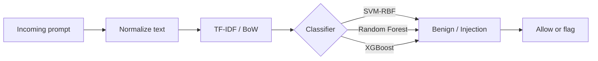

<div align="center">


<br>


**A lightweight ML perimeter for detecting prompt injection before it reaches an LLM-powered code assistant.**

[Paper](docs/PIShield-Paper.pdf) · [Presentation](docs/Presentation.pptx) · [Dataset source](https://huggingface.co/datasets/rogue-security/prompt-injections-benchmark)

</div>

---

## 🛡️ What PIShield does

PIShield treats prompt injection as a **binary text-classification problem**: every incoming prompt is classified as either **benign** or **injection** before being passed downstream.

It compares three classical classifiers — **SVM-RBF**, **Random Forest**, and **XGBoost** — using **TF-IDF** and **Bag-of-Words** representations. The detector is model-agnostic and does not require access to LLM weights, hidden states, or provider APIs.

<table>
<tr>
<td align="center"><strong>5,000</strong><br><sub>labeled prompts</sub></td>
<td align="center"><strong>89.33%</strong><br><sub>best test accuracy</sub></td>
<td align="center"><strong>0.8689</strong><br><sub>best injection F1</sub></td>
<td align="center"><strong>0.9601</strong><br><sub>best ROC-AUC</sub></td>
</tr>
</table>

## 🧠 Detection pipeline



The training workflow uses a fixed **70/30 split**, **5-fold stratified cross-validation**, F1-scored grid search, class reweighting, and a held-out test set.

## 🏆 Results

Held-out results reported in the project paper:

| Model | Accuracy | Precision | Recall | F1 | ROC-AUC |
|:--|--:|--:|--:|--:|--:|
| **SVM-RBF** | **0.8933** | **0.8562** | **0.8819** | **0.8689** | **0.9601** |
| XGBoost | 0.8653 | 0.8202 | 0.8502 | 0.8350 | 0.9433 |
| Random Forest | 0.8380 | 0.7572 | 0.8769 | 0.8126 | 0.9315 |

> **Best configuration:** SVM-RBF + TF-IDF with `C = 4.0` and `gamma = 0.5`.


## 🚀 Quick start

```bash
git clone https://github.com/Rayan-and-beyond/PIShield.git
cd PIShield

python3 -m venv .venv
source .venv/bin/activate
pip install -r requirements.txt
python main.py
```

## 📊 Dataset

The repository includes the exact split used in the study, derived from [rogue-security/prompt-injections-benchmark](https://huggingface.co/datasets/rogue-security/prompt-injections-benchmark).

| Split | Rows | Benign | Injection |
|:--|--:|--:|--:|
| Training | 3,500 | 2,098 | 1,402 |
| Held-out test | 1,500 | 899 | 601 |

The upstream dataset is distributed under **CC BY-NC 4.0**.

## 🧩 Repository map

```text
PIShield/
├── main.py                  # end-to-end training + evaluation
├── requirements.txt
├── data/                    # fixed train/test split
├── src/
│   ├── preprocessing.py     # conservative text cleaning
│   ├── feature_engineering.py
│   ├── models.py            # SVM, RF, XGBoost
│   ├── imbalance.py
│   └── evaluate.py
├── results/models/          # generated model artifacts
├── assets/                  # logo + README artwork
└── docs/                    # paper + presentation
```
## 🔬 Reproducibility

- Random seed is fixed at `42`.
- The 70/30 train-test split is checked into the repository.
- Hyperparameter selection happens on the training split only.
- Vectorization stays inside each scikit-learn pipeline to avoid leakage across CV folds.
- Generated `.joblib` files are ignored and can be recreated with `python main.py`.

## 🎓 Academic context

PIShield was developed for **CS 522: Selected Topics in Computer Science** at the College of Computer Science and Information Technology, Imam Abdulrahman bin Faisal University.

**Team:** Mohammed Alghaith · Muhannad Almahmoud · Abdullah Aladwani · Omar Alnasser · Rayan Alhusennan · Sultan Alotaibi

📄 **[Read the project paper](docs/PIShield-Paper.pdf)**

📊 **[Open the presentation](docs/Presentation.pptx)**

<details>
<summary><strong>⚠️ Scope & limitations</strong></summary>

<br>

PIShield is a research prototype built around lexical prompt features. The study uses one 5,000-prompt benchmark, focuses on prompt-level classification, and was not benchmarked as an inline production IDE gateway. Adaptive paraphrasing can also weaken lexical detectors.

</details>

---

<div align="center">
<sub>Built as a practical, white-box-free first line of defense for LLM-powered code assistants.</sub>
</div>
