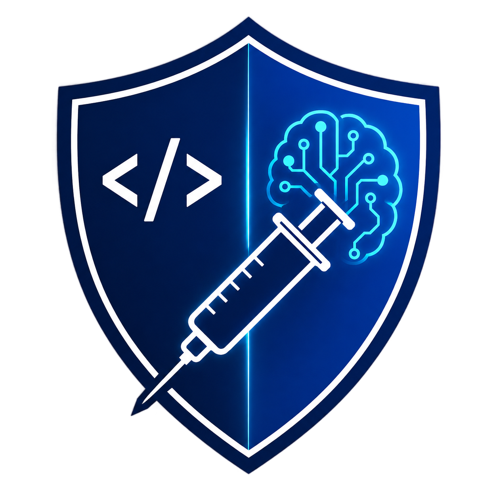
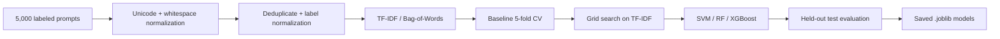

<div align="center">
  
  <h1>PIShield</h1>
  <p><strong>Prompt-injection detection for LLM-powered code assistants.</strong></p>
  <p>Selected Topics in Computer Science · Imam Abdulrahman bin Faisal University</p>
</div>

---

## What it does

PIShield is a lightweight machine-learning detector that sits in front of an LLM-powered code assistant and classifies incoming prompts as **benign** or **prompt injection** before they reach the model.

The project compares three classical classifiers — **SVM**, **Random Forest**, and **XGBoost** — across **TF-IDF** and **Bag-of-Words** features. It keeps the detection layer model-agnostic: the classifier only needs the incoming text, so it does not require access to an LLM's weights, hidden states, or provider APIs.

The training pipeline uses a fixed 70/30 dataset split, 5-fold stratified cross-validation, F1-scored grid search, class reweighting, and a held-out test set.

## Results

Held-out test results reported in the project paper:

| Model | Accuracy | Precision | Recall | F1 | ROC-AUC |
| --- | ---: | ---: | ---: | ---: | ---: |
| **SVM-RBF** | **0.8933** | **0.8562** | **0.8819** | **0.8689** | **0.9601** |
| Random Forest | 0.8380 | 0.7572 | 0.8769 | 0.8126 | 0.9315 |
| XGBoost | 0.8653 | 0.8202 | 0.8502 | 0.8350 | 0.9433 |

The final configuration is **SVM-RBF + TF-IDF**, with `C = 4.0` and `gamma = 0.5`.

## Pipeline



The implementation keeps vectorization inside each scikit-learn pipeline, so vocabulary fitting happens only on training folds during cross-validation.

## Quick start

```bash
git clone https://github.com/Rayan-and-beyond/PIShield.git
cd PIShield

python3 -m venv .venv
source .venv/bin/activate
pip install -r requirements.txt

python main.py
```

`main.py` runs baseline cross-validation, tunes all three classifiers, evaluates the tuned models on the held-out test set, prints the metrics table, and writes trained pipelines to `results/models/`.

## Dataset

The repository includes the fixed split used in the study, derived from [`rogue-security/prompt-injections-benchmark`](https://huggingface.co/datasets/rogue-security/prompt-injections-benchmark).

| File | Rows | Benign | Injection |
| --- | ---: | ---: | ---: |
| `data/train_dataset_70.csv` | 3,500 | 2,098 | 1,402 |
| `data/test_dataset_30.csv` | 1,500 | 899 | 601 |

The upstream dataset is distributed under **CC BY-NC 4.0**. Keep its attribution and license terms when redistributing the data.

## Repository structure

```text
PIShield/
├── main.py
├── requirements.txt
├── data/
│   ├── train_dataset_70.csv
│   └── test_dataset_30.csv
├── src/
│   ├── config.py
│   ├── data_loading.py
│   ├── preprocessing.py
│   ├── feature_engineering.py
│   ├── models.py
│   ├── imbalance.py
│   └── evaluate.py
├── results/
│   └── models/
├── assets/
│   └── logo.png
└── docs/
    ├── PIShield-Paper.pdf
    └── Presentation.pptx
```
## Reproducibility

- `RANDOM_SEED = 42` is used across NumPy, scikit-learn, and XGBoost.
- The 70/30 train-test split is checked into the repository.
- Hyperparameter selection uses stratified 5-fold cross-validation on the training split only.
- The held-out test set is evaluated after model selection.
- Generated `.joblib` model binaries are ignored by Git and can be recreated with `python main.py`.

## Academic context

PIShield was developed as a **Selected Topics in Computer Science** course project at the College of Computer Science and Information Technology, Imam Abdulrahman bin Faisal University.

Project team: Mohammed Alghaith, Muhannad Almahmoud, Abdullah Aladwani, Omar Alnasser, Rayan Alhusennan, and Sultan Alotaibi.

The full methodology, experimental setup, results, and limitations are in [`docs/PIShield-Paper.pdf`](docs/PIShield-Paper.pdf). The project presentation is available at [`docs/Presentation.pptx`](docs/Presentation.pptx).

## Scope and limitations

PIShield is a research prototype built around lexical prompt features. The study evaluates one 5,000-prompt benchmark and does not claim coverage of every language, attack style, or adaptive paraphrase. It performs prompt-level classification and was not benchmarked as an inline production IDE gateway.

## References

- [Prompt Injections Benchmark — rogue-security](https://huggingface.co/datasets/rogue-security/prompt-injections-benchmark)
- Project paper: [`PIShield-Paper.pdf`](docs/PIShield-Paper.pdf)
